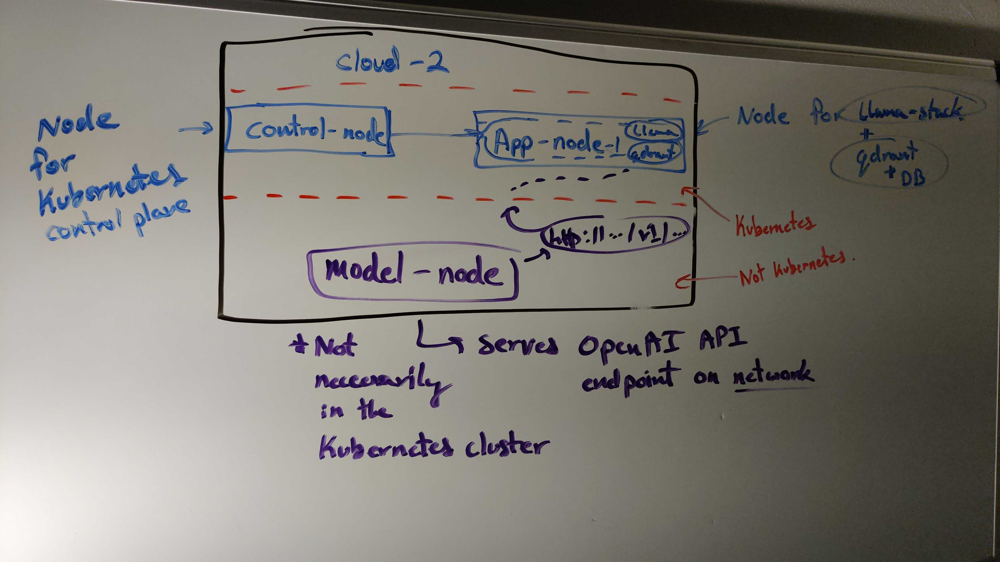

# 💬 UML University Chatbot

## ❓ What
A University Chatbot for the [University of Massachusetts Lowell](https://uml.edu) that can answer a variety of questions about the university.  

## 👨‍💻 Technologies
- [Ramalama](https://github.com/containers/ramalama)
- [Retrieval Augmentation Generation](https://en.wikipedia.org/wiki/Retrieval-augmented_generation)
- [AWS ECR](https://docs.aws.amazon.com/AmazonECR/latest/userguide/what-is-ecr.html) OCI Compliant Registry
- [GitHub Actions](https://docs.github.com/en/actions) CI
- "Kubhanetes" and Containers
- [Ollama](https://ollama.com/)
- [Llama Stack](https://github.com/llamastack/llama-stack)
- [Qdrant](https://qdrant.tech/)

## ➰ Workflow
Divided deployment on Kubernetes and on VM.
Model runs on directly on VM and exposes an OpenAI API endpoint to call.
LLama-Stack and Qdrant run within a Kubernetes cluster. 
RAG Database container image is attached to Qdrant within the cluster.

### RAG
1. `rag-runner` container image hosted on `gcp-rag-runner` ECR repo. Builds and uploads RAG database image.
2. RAG database container image stored on another ECR repo
3. Manually trigger a Kubernetes Job to (re)build the RAG database

> [!IMPORTANT]
> To update any part of the RAG database building process, locally rebuild and push the `rag-runner` image to the ECR repo. Future jobs automatically fetch the new image.

## 🗫 Members
- Gurpreet Singh
- Nick Bottari
