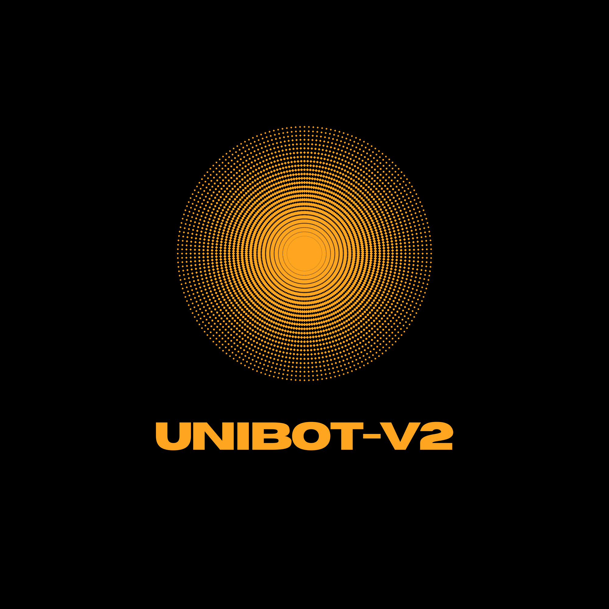

    
    

## ❓ What

A University Chatbot for the [University of Massachusetts Lowell](https://uml.edu) that can answer a variety of questions about the university.  

## 👨‍💻 Technologies

- [GitHub Actions](https://docs.github.com/en/actions) CI
- [Kubernetes](https://github.com/kubernetes/kubernetes)
- [Longhorn](https://github.com/longhorn/longhorn)
- [Ollama](https://github.com/ollama/ollama)
- [Redis](https://github.com/bitnami/charts/blob/main/bitnami/redis/README.md) on K8s
- [AWS SSM Parameter Store](https://docs.aws.amazon.com/systems-manager/latest/userguide/systems-manager-parameter-store.html)
- [Streamlit](https://github.com/streamlit/streamlit)
- [LangGraph](https://github.com/langchain-ai/langgraph)
- [LangChain](https://github.com/langchain-ai/langchain)
- [FastMCP](https://github.com/prefecthq/fastmcp)
- [Grafana](https://github.com/grafana/grafana)
- [Prometheus](https://github.com/prometheus/prometheus)

## 📜 Documentation

Available [here](https://umlcloudcomputing.org/docs/category/unibot-v2) on the club website.

## ➰ Workflow

Divided deployment on Kubernetes and on VM.
Inference model, embedding model, and docling chunker run directly on VM and expose an Ollama API endpoint and `docling-serve` API endpoint to call.

### General

### Orchestrator

The orchestrator handles the tool calling loop between the model and the available tools. It operates using LangGraph and LangChain and is interfaced with a `v1/chat` endpoint running as a simple web server.

There is currently only synchronous endpoint support.

### MCP Servers

- [UML-NOW-MCP](https://github.com/UMLCloudComputing/uml-now-mcp)
- [UML-Search-MCP](https://github.com/UMLCloudComputing/uml-search-mcp)

### Database Pipeline (DEPRECATED)

The design is intended to be fast and scalable. It leverage asynchronous API calls, multi-threading and a producer-consumer approach with thread-safe queues.
